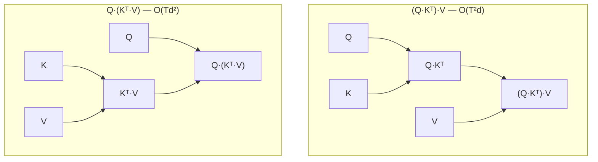

# catopt

[](https://github.com/luisfuturist/catopt/actions/workflows/ci.yml)


**A program optimizer's reachable set is bounded by its semantic
language, not its search strategy.**  Tensor-level compilers rewrite
*ops*; catopt rewrites over *algebraic structure* — monoid carriers,
traced-monoidal fixpoints, products as `⟨f₁,…,f_k⟩ = (×fᵢ)∘Δ` — so it
reaches programs no op-level pattern composes to.  Every delivered
program carries a **replayable certificate** of equivalence, re-checked
on real terms.  The engine separates four independent dimensions —
semantics, search, evaluation and execution
([ADR 0003](project/adrs/0003-evaluation-is-an-independent-dimension.md))
— and how a candidate actually runs on a target is *measured*, never
assumed.

## Game

catopt is, structurally, **a game**.

**Rules.**  The rewrite laws are *derived from category theory*, not
enumerated as op patterns: associativity of composition, the unit and
interchange laws, the traced-monoidal axioms, products, and monoid
carriers.  A rewrite is a **2-cell**; a law *about* rewrites is a
**3-cell** (coherence); the e-graph is the **higher-categorical board**
those cells live on ([ADR 0002](project/adrs/0002-categorical-re-expression-thesis.md)).

**Moves.**  Applying a law — a rewrite.

**Board.**  The e-graph: every program *known equal* to yours, in one
place.  The board is the whole equivalence class, not one term.

**Referee.**  The **certificate**.  `verify_certificate` replays the
derivation on real terms, so whatever the player does, the output is
provably the same function.  **This is the differentiator.**  egglog has
proof-carrying rewriting and Catlab / AlgebraicJulia does categorical
rewriting, but the *combination* — derived laws + machine-checked
replay + a learned player + a compiler IR — is the claim.

**Score.**  A pluggable, per-target cost model.  Evaluation is an
independent dimension ([ADR 0003](project/adrs/0003-evaluation-is-an-independent-dimension.md)),
so the score never decides semantics.

One call runs the whole game:

```python
from catopt_orchestrator import Optimizer
from catopt_torch import TorchBackend

opt, stats = Optimizer(backend=TorchBackend()).optimize(model, x)
out = opt(x)        # the same function as model(x) — verified, not spot-checked
```

The game pays off concretely on attention: from associativity alone, the
board reaches `(Q·Kᵀ)·V → Q·(Kᵀ·V)`, turning an O(T²d) intermediate into
an O(Td²) one — a transform **nobody wrote down** (the details are
[below](#the-transformation-it-found)).

## RL Player

The player is a **`Policy`**, and it may only **reorder legal moves**.
It can never change equivalence: a random player reaches the *identical*
equivalence class, and the certificate still replays.  That safety
property — a policy that cannot make a program wrong — is what makes a
learned player admissible at all.

**It ships.**  The curriculum-trained contraction player is a bundled
artifact — 25.6 KiB, trained once, loaded lazily:

```python
import catopt_torch
policy = catopt_torch.load_contraction_policy()   # the trained player
order = policy.order(tensors, sizes)               # one deterministic pass
```

**The expectation: outperform humans.**  "Humans" means the hand-written
heuristics — our `greedy`/`search`/`restart` players and `opt_einsum`'s
orderings.  **The measured reality:**

- **Beats the deterministic external greedy at n = 40** by ~25–30%
  (0.68–0.73× pairwise, after training at scale), and reaches **~1.04×
  of `opt_einsum`'s randomised greedy** at adequate budget — near parity
  with the field's best cheap player, in a single pass
  ([contraction-train-scale.md](project/retros/contraction-train-scale.md)).
- **Throughput-starved at < 50 ms budgets** — a forward pass per
  decision is the honest cost.
- **Two structural limits, both measured.**  In catopt's own e-graph,
  reordering **cannot change extracted cost** (the fixed point is
  order-invariant — a random player reaches identical cost); and as a
  *law proposer* the learned player loses ~10× to enumeration —
  **corpus knowledge is the discovery**
  ([law-meta-game.md](project/retros/law-meta-game.md)).

So the player's value lives where the choice is **not** order-invariant:
contraction ordering (shipped), extraction/coordination — not rule
reordering and not law invention.

## Player Finds

What the machine has found, verified and shipped — three laws in
`DEFAULT`:

**`select_mul`** — the first machine-discovered law (census-naturality
proposer).  `mul(select(u,D,I), select(v,D,I)) → select(mul(u,v),D,I)`:
true on all 24 real sites, fires 24× across 5 models, **17–26% modeled
cost drop**, cert replays
([law-shape-aware.md](project/retros/law-shape-aware.md)).

**`softmax_fold`** — `div(exp(u), sum(exp(u),dim,keepdim)) →
softmax(u,dim)`: the manual normalization is the kernel's definition
spelled out.  Found by *pattern recognition* over the corpus's composed-
then-reduced chains; −19% cost, and **+13–48% measured wall-clock** on
the real model
([law-softmax-fold-shipped.md](project/retros/law-softmax-fold-shipped.md),
[law-wallclock-verification.md](project/retros/law-wallclock-verification.md)).

**`silu_fold`** — `mul(x, sigmoid(x)) → silu(x)`: a **3-cell mediator**.
The coherence catalogue — pairwise relations over all 53 laws — found
two genuinely divergent pairs (`silu` expansion destroys the
`swiglu_fuse` redex).  This law restores confluence **and pays**
(1.43–2.62× on the bench case)
([three-cell-mediator.md](project/retros/three-cell-mediator.md)).

**The loop is closed.**  `tools/law_pipeline.py` runs
census → propose → verify → measure → rank → **emit** end to end:

- **Validated by held-out rediscovery** — a shipped winner re-ranks
  #1, shippable, every run.
- **The op vocabulary is machine-derived too** — ops are classified by
  property tests (commutes-with-views, value-preserving), not human
  tables; the derived alphabet recovers every hand entry *plus* the
  ones humans missed
  ([law-vocab-derived.md](project/retros/law-vocab-derived.md)).
- **`--emit-admission` emits the `R(...)` + tests** as a `git apply`
  patch; the emitted law is bytecode-identical to the hand-written one
  ([automated-admission.md](project/retros/automated-admission.md)).
- **The referee catches its own pool**: `reshape_transpose` fires 23×
  and cost-lowers yet is **numerically false** — the oracle rejects it;
  an oracle rank-mismatch hole was found by the meta-game and closed
  in both oracles ([oracle-rank-mismatch-fix.md](project/retros/oracle-rank-mismatch-fix.md)).
- **Honest limits**: learned-proposal loses to enumeration; workload
  resampling can't feed self-play — law-bearing shapes come from
  architecture semantics, not op marginals
  ([law-workload-gen.md](project/retros/law-workload-gen.md)).

## Benchmark

Every number below is measured on the dev box (RTX 2050, fp64,
launch-bound sizes — see [Limits](#limits)):

| measurement | result | source |
|---|---|---|
| `softmax_fold` on `ManualSoftmaxAttention` | **+13–27% eager, +29–48% CUDA-graph** vs raw | `tools/law_wallclock.py` |
| `select_mul` marginal (optimized vs law-ablated) | **faster in 19/20 measurements** | `tools/law_wallclock.py` |
| executor routing after measured pricing | **12/12 cases ship the measured-fastest member** (was 2–3× slower) | `tools/executor_cost_probe.py` |
| `silu_fold` on the bench case | **−53–55% cost, 1.43–2.62× wall-clock** | `bench run law_bench` |
| contraction player n=40 vs `opt_einsum` | **~1.04× randomised greedy, 0.68–0.73× deterministic** | `tools/contraction_einsum.py` |
| pipeline held-out rediscovery | **winner re-ranks #1, every run** | `tools/law_pipeline.py` |
| coherence catalogue | **30 basis laws / 53; divergence 0** | `tools/law_coherence.py` |
| bounded rewrites vs Inductor, real checkpoint | **1.15–1.32×** | `bench/suites` |

Full measured picture and provenance: [`docs/results.md`](docs/results.md).

---

## The transformation it found

`(Q·Kᵀ)·V → Q·(Kᵀ·V)`: the intermediate goes from T×T to d×d — an
asymptotic change (O(T²d) → O(Td²)), not a tuning.

**Reassociation itself is not the novelty.**  Matrix-chain
parenthesization is a compiler optimization from 1975 (Sethi–Ullman),
and any optimizer that reassociates can reach this shape.  What catopt
adds is that nobody wrote *this* transform down: the e-graph derives it
from associativity plus a shape-aware cost model, the certificate
proves it, and the pipeline delivers it end to end.  **There is no
hand-written "reassociate attention" rule** — the attention-specific
laws that do exist (`laws/attention.py`) are *folds* into `sdpa`, not
this reassociation.



The novelty is not the algebra — it is that the optimizer *discovered*
and *certified* it, and delivers it end to end, without an
attention-specific rule.

## The idea in three steps

1. **Lift.**  The model *and its weights* export into one typed term
   (torch: `torch.export`); parameters are ordinary leaves.
2. **Search.**  Equality saturation closes that term under equational
   *and* categorical laws — associativity, homomorphism, the traced
   monoidal axioms, the product law — enumerating the equivalence class
   rather than applying a fixed pass list.
3. **Prove and deliver.**  A cost model extracts the cheapest
   representative the backend can actually lower; the derivation is
   verified; you get back a runnable `torch.nn.Module` plus a stats dict
   (`stats["rule_fires"]`, `stats["lowering"]`, `stats["runner"]`, …).

→ The conceptual pipeline is in [`docs/mechanism.md`](docs/mechanism.md);
the thesis it implements is
[ADR 0002](project/adrs/0002-categorical-re-expression-thesis.md).

## Quickstart

```bash
uv sync                 # dev env — all workspace members editable
python demo.py          # ~60-second end-to-end run on CPU
```

`demo.py` walks one gated projection block through the whole pipeline:
the e-graph search, the certificate replayed through the standalone
verifier, the extracted op tree, and a synced median race against eager
and `torch.compile`.  It re-execs under `PYTHONHASHSEED=0`, so the
search, extraction and certificate are bit-for-bit reproducible.

## The four dimensions, in the API

Semantics, search, evaluation and execution are separate — and each is
reached from a real call, not a promise:

| Dimension | Reach it with |
|---|---|
| semantics | `verify_certificate(ir.root, cert, strict=True)` — every delivered program ships a replayable derivation |
| search | `policy=` on `search` / `Optimizer.optimize`: a `Policy` (random / greedy / learned / RL) orders the rules each iteration — see [RL Player](#rl-player) |
| evaluation | `criteria=PredictedCriterion(model)` prices extraction through a `PerformanceModel`; `SearchResult.frontier({...})` returns the non-dominated set; `StaticProfiler` describes a program without running it |
| execution | the `Sink` / `Runner` / `Meter` ports — and `catopt_core.failures` classifies what went wrong |

```python
from catopt_core.perf_model import AnalyticalPerformanceModel
from catopt_core.policies import GreedyPolicy
from catopt_orchestrator import Optimizer, PredictedCriterion
from catopt_torch import TorchBackend

opt = Optimizer(backend=TorchBackend())
mod, stats = opt.optimize(
    model, x,
    criteria=PredictedCriterion(AnalyticalPerformanceModel()),  # a model prices extraction
    policy=GreedyPolicy(),                                      # a policy picks the order
)
stats["criteria"], stats["policy"]      # {'predicted': 1.0}, 'greedy'
```

A policy may only **reorder** — every rule still runs, so the fixed
point and the certificate are unchanged (a random player reaches the
identical equivalence class).  A model may only **rank** — feasibility
(`supported_ops`) still decides what is reachable at all.

Train a policy on your own programs:

```bash
python tools/train_search_policy.py --device cuda   # supervised rule value
python tools/train_rl_policy.py     --device cuda   # REINFORCE over the search env
```

→ [`docs/evaluation.md`](docs/evaluation.md) for the whole dimension.

## What it finds — and what it doesn't

The measured picture is generated from the pinned baselines — see
[`docs/results.md`](docs/results.md) for magnitudes, hardware and
provenance.  The verdicts:

| Regime | Verdict | Why |
|---|---|---|
| Deep weight chains (`reassoc_scale`) | **WIN** | the e-graph reaches a weights-first form Inductor's post-grad graph provably cannot express |
| Shared-input projections / gated blocks (`real_win_hunt`, `killer_demo`) | **WIN** | pairing fuses k projections into one GEMM + split views |
| Linear-attention scan lift (`real_linear_attn`) | **WIN** | the affine-monoid scan lift fires and verifies fp64-exact |
| Morphism windows (`morphism_e2e`) | **WIN** | term-FLOP reduction converts to wall time at GEMM-bound sizes |
| Whole-model E2E (`e2e_model`, `e2e_models2`) | **PARITY** | pairing fires per block and verifies fp64-exact, but wall time is ~parity |
| Real trained checkpoints, exact mode (`structure_census`) | **PARITY** | dense weights carry ~zero exploitable bitwise structure |
| Launch-bound decode (`decode_bench`) | **NEGATIVE** | fewer launches don't pay where launch overhead already dominates — the hypothesis is falsified |
| Bounded rewrites on a real checkpoint (`bounded_e2e`) | **WIN (bounded)** | `error_budget=` delivers **1.15–1.32× vs Inductor** on stories15M via certified elision of near-duplicate tied-head rows — bounds propagate to outputs, verified-with-tolerance, KL≈0 at τ=1e-4 |

This is **not a universal speedup**.  Attention- and GEMM-bound code is
already optimal — expect a parity floor there — and the losses are
measured too.  The wins live where structure exists: shared-input
projections, foldable weight chains, unnormalized attention,
recurrences.

## Verification is the point

Discovery is cheap; pricing is hard; proof is what keeps it honest.
Every extracted program ships with an ordered, replayable derivation
`original → optimized`, and `verify_certificate` re-checks
*derivational equivalence* on real terms (fp64) — not numerical
spot-checks:

```python
from catopt_core.egraph import verify_certificate

verify_certificate(ir.root, cert, strict=True)   # replay every step
```

It has caught a false-proof matcher bug, a shape misinference that
fabricated a 1.98× "win", a well-typed but wrong program, and a
launch-time-vs-execution timing bug — all regression-tested.

## Generality — the honest split

The **framework** is general: e-graph saturation, verification, cost
extraction, backends, strategies, runners and rule sets are all
pluggable and model-agnostic.  What is **narrow** is the *law library*:
like every rule-based optimizer (Halide, TASO, verified compilers),
catopt finds the structures its laws describe — an unmatched block is an
opaque boundary, never a wrong answer.  The morphism engine is the
generality mechanism: laws target signature *classes* (any residual
chain, any shared-projection family) rather than specific op trees.

## Related work

Catopt sits at the intersection of equality saturation, tensor-graph
superoptimization, and verified rewriting.  The contribution is not new
algebra — it is *automatic discovery + certified equivalence + per-shape
selection*, delivered end to end.  How it relates:

| Line of work | Shares | Differs |
|---|---|---|
| **egg / egglog** | e-graph, saturation, cost-guided extraction | catopt's laws are *categorical* (monoid carriers, traced monoidal, products), not op patterns, and it delivers a runnable module plus a certificate rather than a term.  A differential oracle cross-checks its search against egglog on a law subset (`tests/test_egglog_oracle.py`). |
| **TASO** (tensor superoptimization) | equivalence-preserving graph rewrites, verified candidates | backtracking substitution search vs e-graph closure; catopt reaches non-local forms (scan lifts, weight folds) and ships a replayable derivation. |
| **Tensat** | cost-based extraction over an e-graph | Tensat searches op-level tensor equivalence; catopt's laws are over algebraic structure, and extraction is bounded by the backend's `supported_ops`. |
| **TVM / Ansor / Halide** | schedule search, cost models, target tuning | they search *schedules over a fixed algorithm*; catopt searches *across algorithms* via algebraic laws, then hands the result to a backend. |
| **Herbie** | e-graph rewrite search | different objective (numerical accuracy, not cost); same saturation lineage. |
| **Verified rewriting** (Alive2, CompCert) | machine-checked equivalence | catopt's certificate is per-program *derivational replay* on real terms, not a whole-compiler proof. |
| **torch.compile / Inductor** | the baseline measured against | op-level fusion cannot express transforms across runtime parameters (weight folding, reassociation) — which is where catopt's wins live. |

## Limits

- **Wins are regime-dependent** — the transform set is structural:
  pairing, folds, reassociation, carrier lifts.  A model that is already
  dense-GEMM-bound with no shared structure should expect parity.
- **Search is compile-time work** — seconds per block; monolithic eqsat
  slows past ~8 blocks, which is why the `Compositional` strategy exists.
- **Inference only** — weight folding destroys per-layer gradients; no
  backward-graph rewriting.
- **Coverage gaps** — `matmul`+bias and grouped convs aren't pairable;
  reassociation needs unnormalized attention; masks must arrive
  materialized.
- **Dev-box numbers** — measured on an RTX 2050 (4 GB) / CPU.
  `calibrate()` re-targets the cost model, but magnitudes do not
  extrapolate to datacenter hardware.

## Install

Python ≥3.11 (developed on 3.13), `torch>=2.0`, `numpy>=1.24`.
uv-workspace monorepo: `packages/catopt-core` (zero-dependency engine),
`catopt-torch` (PyTorch adapters), `catopt-carriers` (scan/attention
carriers), `catopt-cuda` (the CUDA-graph runner), `catopt-orchestrator`
(the backend-neutral pipelines).  There is no `catopt` façade package —
import the domain packages directly.

```bash
uv sync                                  # everything, editable

# or with pip:
pip install -e packages/catopt-core -e packages/catopt-torch \
    -e packages/catopt-carriers -e packages/catopt-cuda \
    -e packages/catopt-orchestrator

pip install -e packages/catopt-core      # engine only, zero deps
```

Optional: `packages/catopt-native` is the PyO3/Rust search engine
(build with maturin; opt-in via `engine=` — never auto-detected).

## Benchmarks

Every claim above is a runnable suite under `bench/`, and the harness is
a system rather than a pile of scripts: each suite states its conclusion
as a typed **finding** (`win` / `parity` / `regression` / `negative` /
`inconclusive`), and every surface — JSON, Markdown, HTML, plots,
Quarto, Slidev — is rendered from one canonical `Report`.

```bash
python -m bench list                        # the catalog
python -m bench run reassoc_scale           # one suite → JSON+MD+HTML+plots
python -m bench run-all                     # every harnessed suite
python -m bench results                     # regenerate docs/results.md
python -m bench dashboard                   # cross-suite HTML index
```

Suites are organized by **intent** — the question each answers.
`bench/registry.py` is the single source of truth; `bench/README.md`
carries the generated catalog with expected verdicts.  Per-suite
protocols, flags and expected outcomes: [`bench/README.md`](bench/README.md).

## Docs

| Doc | What it is |
|---|---|
| [`docs/mechanism.md`](docs/mechanism.md) | the conceptual pipeline — syntax → structure → search → certificate |
| [`docs/evaluation.md`](docs/evaluation.md) | the evaluation dimension — features, frontier, policies, learned policy |
| [`docs/results.md`](docs/results.md) | measured results, generated from the pinned baselines |
| [`docs/api.md`](docs/api.md) | the API surface — `Optimizer`, strategies, runners, criteria, ports |
| [`bench/README.md`](bench/README.md) | the benchmark harness and its suite catalog |
| [`project/RESEARCH_WRITEUP.md`](project/RESEARCH_WRITEUP.md) | the claim, the verified results, the honest negatives |
| [`project/REPORT.md`](project/REPORT.md) | the research report — weights as programs, the ε axis, what was falsified |
| [`AGENTS.md`](AGENTS.md) | repo layout, verification commands, port contracts |
