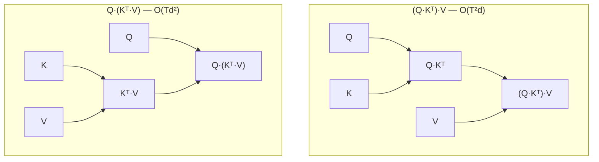

# catopt

[](https://github.com/luisfuturist/catopt/actions/workflows/ci.yml)


**catopt rewrites neural-network computation graphs over algebraic
structure — monoid carriers, traced-monoidal fixpoints, products — not
over op patterns, and ships every result with a replayable certificate
of equivalence.**  It is a research-grade optimizer and a worked
example of one thesis, aimed at people who build compilers, tensor-graph
superoptimizers, and verified rewriting systems.

The claim is falsifiable and stated up front: **a program optimizer's
reachable set is bounded by its semantic language, not its search
strategy.**  Op-level compilers rewrite *generators*; catopt rewrites
*morphisms up to structure*, so its reach is the closure of its law
library — strictly larger than any fixed pass list.  The engine keeps
four dimensions independent and measures how a candidate runs instead
of assuming it.

## The thesis

A tensor program is a morphism in a hypergraph monoidal category.
Optimization is search in the quotient of the free category on the IR's
generators, by the laws of the structures the program instantiates —
monoids, comonoids, traces, contraction
([ADR 0002](project/adrs/0002-categorical-re-expression-thesis.md)).
The interpretation is not unique, and choosing the richest one is the
creative act: the same graph reads as plain composition, a shared-input
comonoid (pairing), a low-rank approximation (bounded), or a contraction
problem, each exposing different laws.  The deliverable is always a
cheaper program **and its proof** — exact equivalence, or a certified
bound, never silent approximation.

## Architecture

Four independent dimensions ([ADR 0003](project/adrs/0003-evaluation-is-an-independent-dimension.md)).
No layer answers another's question: a cost model must not change
semantics, a policy must not decide equivalence, a profiler must not run
on the target.

```text
SEMANTICS ──▶ SEARCH ──▶ EVALUATION ──▶ EXECUTION
 "equivalent?" "explore?"  "how does it   "what actually
                            look / run?"    ran?"
```

| Dimension | Question | Reach it with |
|---|---|---|
| semantics | Is it equivalent? | `verify_certificate(ir.root, cert, strict=True)` — every delivered program ships a replayable derivation |
| search | What should we explore? | `policy=` on `search` / `Optimizer.optimize`: a `Policy` (random / greedy / learned) orders the rules each iteration |
| evaluation | What does it look like / what might run well? | `criteria=PredictedCriterion(model)`; `SearchResult.frontier({...})`; `StaticProfiler` describes a program without running it |
| execution | What actually ran? | the `Sink` / `Runner` / `Meter` ports; `catopt_core.failures` classifies what went wrong |

**Package map** (a uv-workspace monorepo; there is no `catopt` façade —
import the domain packages directly, plan 0008):

| package | role |
|---|---|
| `catopt-core` | the torch-free engine: IR, e-graph, laws, cost, ports, features |
| `catopt-torch` | PyTorch adapters: export/import bridge, `TorchSink`, the contraction player |
| `catopt-carriers` | carrier laws and executors (scan, attention) |
| `catopt-cuda` | the CUDA-graph runner (`CudaGraphRunner`) |
| `catopt-orchestrator` | the backend-neutral pipeline: `Optimizer`, strategies, morphisms |
| `catopt-discovery` | the law-discovery engine — invoke as `python -m catopt_discovery.<mod>` |
| `catopt-native` | optional PyO3/Rust search engine (excluded from the workspace; opt-in via `engine=`) |

The dependency arrow points core ◀ adapter, never core ▶ CUDA.  The
hexagonal boundary is pinned by import-linter:
`catopt_cuda` ▶ {`catopt_torch`, `catopt_carriers`} ▶ `catopt_orchestrator`
▶ `catopt_native` ▶ `catopt_core`.  `catopt_core` imports no `torch`,
`numpy`, or GPU library — it is a *sink* for adapter-pushed state, never
a puller.  A new backend implements `Sink`; nothing in core changes.

## The game

catopt is, structurally, a game played on a **tower of morphisms** —
the n-cell picture where programs, rewrites, proofs and metarules are
the same kind of thing at different dimensions:

| level | cell | in catopt |
|---|---|---|
| 0 | objects | tensor types / shapes |
| 1 | morphisms | **programs** — a term `a ~> b` |
| 2 | rewrites | **laws** — equalities between programs (`lhs ~ rhs` + guards) |
| 3 | coherences | **derivations between laws** — a `lemma` is a 2-cell proven from premises; the coherence catalogue measures confluence and divergence |
| ↑ | polymorphic forms | **declared objects** — folds, lifts, compositions written *as data* (`opdata`/`evidence` records) |

Two games are played on that tower:

- **The search game** — moves *apply* 2-cells.  The **e-graph is the
  board**: every program *known equal* to yours, in one place; a move
  walks it, extraction picks the cheapest member.  The contraction
  player is a proven winner on this board (0.87–0.99× `opt_einsum`
  randomized greedy at n=40).
- **The construction game** — moves *write new cells into the tower*:
  `fold`/`lift`/`compose` mint objects (`catopt_discovery.object_synthesis`),
  `relax_guard`/`specialize` reshape their regions, `auto_cond`
  writes their guards as declarative data; the evidence store and
  gauntlet referee each write (plan 0020 builds the episode arena).
  Ten machine-written cells are shipped laws today.

Then the shared equipment:

- **Rules.**  The rewrite laws are *derived from category theory*, not
  enumerated as op patterns: associativity of composition, the unit and
  interchange laws, the traced-monoidal axioms, products, and monoid
  carriers ([ADR 0002](project/adrs/0002-categorical-re-expression-thesis.md)).
  The legality relation is semantic equivalence — the tower is the
  grammar, equivalence is the law.
- **Referee.**  The **certificate** — `verify_certificate` replays the
  derivation on real terms — plus the eight-stage admission gauntlet
  for constructed cells.  A player only ever chooses among legal
  moves: it can be slow, never wrong.
- **Score.**  A pluggable, per-target cost model — Pareto utilities
  over FLOPs, measured time and closure blowup; in the construction
  game, concretely: *admitted objects that pay on held-out code*.
  Evaluation is an independent dimension, so the score never decides
  semantics.

One call runs the whole game:

```python
from catopt_orchestrator import Optimizer
from catopt_torch import TorchBackend

opt, stats = Optimizer(backend=TorchBackend()).optimize(model, x)
out = opt(x)        # the same function as model(x) — verified, not spot-checked
```

### The transformation it found

From associativity alone, the board reaches `(Q·Kᵀ)·V → Q·(Kᵀ·V)`,
turning an O(T²d) intermediate into an O(Td²) one.



**Reassociation itself is not the novelty.**  Matrix-chain
parenthesization is a compiler optimization from 1975 (Sethi–Ullman),
and any optimizer that reassociates can reach this shape.  What catopt
adds is that nobody wrote *this* transform down: the e-graph derives it
from associativity plus a shape-aware cost model, the certificate proves
it, and the pipeline delivers it end to end.  There is no hand-written
"reassociate attention" rule.

## What's data

The core design claim is that **laws, guards, objects and the op
vocabulary are data**, not code — so the machine can grow the object
language without growing a pile of Python.

- **Laws.**  `catopt_core.laws.ALL_RULES` holds **71** rules, each an
  `R(name, lhs, rhs, law=, cond=, dspec=, tags=, derivation=)`.  The
  kernel taxonomy is *measured*, not asserted:
  `catopt_discovery.coherence --emit-basis` reports **47 axioms / 13 lemmas /
  2 redundant** (9 promoted conditionals sit uninstanced in the catalogue).  **All 71 serialize completely** — pattern +
  declarative `cond`/`dspec` guards + tags + derivation, no Python — and
  `derivation=` replays into real `Certificate`s.
- **Guards.**  Side conditions prefer the declarative `cond` DSL
  (`catopt_core.laws.cond`, pure data such as
  `("and", ("rank-eq", "a", "b"), ("rank-ge", "a", 2))`, JSON-serializable;
  **45 of 71** rules use it) over procedural `check`/`derive` hooks — the
  escape hatch for conditions the DSL cannot express (**18 of 71** use
  `dspec`).  A record that cannot carry a hook flags it in
  `missing_hooks` rather than weakening silently.
- **Objects.**  The unit of invention is a *declared object* — data the
  referee replays, not an arbitrary rewrite
  ([ADR 0004](project/adrs/0004-abstraction-as-move.md)).  `evidence.py`
  stores objects (`--add-object`) and admits them (`--admit-object KEY
  --gauntlet`); **ten admitted objects have since been promoted into
  `laws/` as real rules** — the loop from machine-found to shipped
  ([promoted-laws.md](project/retros/promoted-laws.md)).
- **Op vocabulary.**  `catopt_core.opmeta` is a single registry of
  **166 ops**; the thirteen op sets that used to be hand-duplicated
  across modules are now named projections of it, with the subset
  relations machine-checked.  The discovery generator's alphabet is
  itself *derived by property test* (`catopt_discovery.vocab`) — an op
  is classified by what it *does* (commutes-with-views, value-preserving),
  not by a lookup table.  And the op *set* is now declarable too:
  `catopt_core.opdata` registers a view/relayout-class op from a data
  `OpDef` (name, arity, tags, attr schema, shape spec in the `cond`
  DSL) — kernels and aten spellings stay code, the structural slice is
  a declaration ([plan 0019](project/plans/0019-ops-as-data.md)).

## The referee

Discovery is cheap; pricing is hard; **proof is what keeps it honest.**
Every extracted program ships with an ordered, replayable derivation
`original → optimized`, and `verify_certificate` re-checks *derivational
equivalence* on real terms (fp64) — not numerical spot-checks.  The
certificate is a hard accept/reject filter, never a soft reward.

```python
from catopt_core.egraph import verify_certificate

verify_certificate(ir.root, cert, strict=True)   # replay every step
```

The referee earns its keep by finding bugs — **including in the shipped
library** (all regression-tested):

| caught | how |
|---|---|
| three shipped matmul laws false on mixed-rank bindings | adversarial witness generation; now guarded |
| `select_mul` latently unsound — `mul` broadcasts along the *selected* axis (`u=(4,), v=(2,4), D=0` falsifies it) | the view/index oracle; now guarded by `dim-eq-attr` |
| `reshape_transpose` fires 23× and cost-lowers yet is numerically false | the oracle rejects it |
| seven shipped guarded laws with measured-unclean regions | the derivable-gate audit; a measured counterexample now outranks a derivation; all tightened |
| a derivation outranking a measured counterexample in the *pipeline's* `truth` and the persisted `verdict` | the truth-parity audit — all three bars (in-memory, store, gauntlet) now refuse a refuted derivation |
| `gqa_absorb_repeat` sweep crash (a `str` attr metavar reaching `_infer_op_shape`) | the guarded-region sweep; fixed |
| a shape misinference that fabricated a 1.98× "win"; a well-typed but wrong program; a launch-time-vs-execution timing bug | the certificate and the equivalence gate |
| three real `nn.*` lowering defects | the workload intake corpus |

### The admission gauntlet

A synthesized object earns the verdict **`usable`** only by clearing the
same eight-stage gauntlet a shipped law faces — a failing gate stops the
run, it does not skip:

> reconstruct → full-data → measure → truth → novelty → typed-pay →
> closure → cert

`truth` is the interesting stage for a conditional candidate: the
pipeline's oracles verify *patterns*, but a stored object carries its own
guard, so the gauntlet sweeps the guarded region itself.  `--auto-cond`
mints the smallest declarative `cond` covering the measured domain and
re-runs.  `usable` means *admitted through the gauntlet, usable by the
pipeline* — **not a shipped law**; promotion to `laws/` stays manual.
See [`admission-gauntlet.md`](project/retros/admission-gauntlet.md) and
[`auto-cond.md`](project/retros/auto-cond.md).

## Results

Every number is measured on the dev box (RTX 2050, fp64, launch-bound
sizes — see [Limits](#limits)); provenance is in
[`docs/results.md`](docs/results.md).

| measurement | result | source |
|---|---|---|
| `softmax_fold` on `ManualSoftmaxAttention` | **+13–27% eager, +29–48% CUDA-graph** vs raw | `tools/law_wallclock.py` |
| `select_mul` marginal (optimized vs law-ablated) | **faster in 19/20 measurements** | `tools/law_wallclock.py` |
| `rms_norm_fold` on the bench case | **−83.3% modeled cost, bitwise fp64-identical, 2.70× wall-clock** | `bench.suites.correctness.law_bench` |
| `silu_fold` on the bench case | **−53–55% cost, 1.43–2.62× wall-clock** | `bench.suites.correctness.law_bench` |
| executor routing after measured pricing | **12/12 cases ship the measured-fastest member** (was 2–3× slower) | `tools/executor_cost_probe.py` |
| morphism windows (`chain_x4@4096×128`) | **best 14.83× vs eager** | `bench.suites.speedup.morphism_e2e` |
| weight-chain reassociation vs Inductor | **17.12× vs Inductor** (18.63× vs eager) at (k,d,B·T)=(16,512,4096) | `bench.suites.speedup.reassoc_scale` |
| bounded rewrites on a real checkpoint | **up to 1.32× vs eager / 1.25× vs Inductor** (stories15M) | `bench.suites.bounded.bounded_e2e` |
| contraction player n=40 vs `opt_einsum` | **0.87–0.99× randomised greedy at equal wall-clock** (0.44–0.60× deterministic) | `tools/contraction_guided_restart.py` |
| pipeline held-out rediscovery | **winner re-ranks #1, SHIP, every run** | `catopt_discovery.pipeline --holdout` |
| pipeline on the 364-term corpus | **shippable = 11** — and **0** with `--real-only` (all 11 are corpus-circular; see negatives) | `catopt_discovery.pipeline` |
| coherence catalogue over `ALL_RULES` | **47 axioms / 13 lemmas / 2 redundant; 9 no-instance; divergence 1** (`rms_norm_fold` × `_nogain` — measured, unresolved) | `catopt_discovery.coherence` |
| workload intake | **254 real `nn.*` workloads, 201 fp64-verified** (corpus 211→725 op-tuples) | `catopt_discovery.intake` |
| laws as data | **71/71 fully serializable** (pattern + `cond`/`dspec` + derivation) | `catopt_core.laws.serialize` |
| evidence store, second run | **19× faster** (verdicts cached by corpus × rules × revision) | `catopt_discovery.pipeline --evidence-db` |

### What it finds — and what it doesn't

| Regime | Verdict | Why |
|---|---|---|
| Deep weight chains (`reassoc_scale`) | **WIN** | the e-graph reaches a weights-first form Inductor's post-grad graph cannot express |
| Shared-input projections / gated blocks | **WIN** | pairing fuses k projections into one GEMM + split views |
| Linear-attention scan lift | **WIN** | the affine-monoid scan lift fires and verifies fp64-exact |
| Morphism windows | **WIN** | term-FLOP reduction converts to wall time at GEMM-bound sizes |
| Whole-model E2E | **PARITY** | pairing fires per block and verifies fp64-exact, but wall time is ~parity |
| Real trained checkpoints, exact mode | **PARITY** | dense weights carry ~zero exploitable bitwise structure |
| Launch-bound decode | **NEGATIVE** | fewer launches don't pay where launch overhead already dominates — the hypothesis is falsified |
| Bounded rewrites on a real checkpoint | **WIN (bounded)** | `error_budget=` delivers a certified member; bounds propagate to outputs, KL≈0 at τ=1e-4 |

This is **not a universal speedup.**  Attention- and GEMM-bound code is
already optimal — expect a parity floor there — and the losses are
measured too.  The wins live where structure exists.

### The learned player (RL)

The player is a **`Policy`**, and it may only **reorder legal moves**.
It can never change equivalence: a random player reaches the *identical*
equivalence class, and the certificate still replays.  That safety
property — a policy that cannot make a program wrong — is what makes a
learned player admissible at all.

**It ships.**  The contraction player is a bundled artifact — 24.9 KiB
of weights, trained once, loaded lazily:

```python
import catopt_torch
policy = catopt_torch.load_contraction_policy()   # the trained player
order = policy.order(tensors, sizes)               # one deterministic pass
```

**The measured reality: it wins.**  Under the guided protocol the
bundled player beats `opt_einsum`'s randomised greedy at n = 40 at equal
wall-clock — **0.87–0.99× oe-cost** across two board sets, three
temperatures and two budgets (best cell 0.868) — and **0.44–0.60×** the
deterministic greedy.  It is distilled from the teacher's trial
distribution; the vectorised lockstep driver gives it ~2× the teacher's
trial rate, and best-of-more at parity beats best-of-fewer.  Honest
edges: throughput-starved under ~50 ms budgets, and the short-budget wins
partially overspent.  The curriculum-RL weights stay bundled as an
alternate.  ([contraction-player-shipped.md](project/retros/contraction-player-shipped.md))

**Rule, not policy — the verdict that defines the project.**  As a *law
proposer* the learned player loses ~10× to enumeration (yield per oracle
call 0.007–0.030 vs 0.292), and on the real discovery board the optimal
schedule is a fixed rule — the trained guide converged to it
(`gap_gen` when a target exists, `workload_gen` when loose, `build`
never), and `usable: yes` was **0 for every guide**.  The learned
schedule is a noisy approximation of the rule, occasionally lucky, losing
on the mean.  **Corpus knowledge is the discovery**
([law-meta-game.md](project/retros/law-meta-game.md),
[guide-real-run.md](project/retros/guide-real-run.md)).  The player's
value lives where the choice is *not* order-invariant: contraction
ordering (shipped), not rule reordering and not law invention.

### Player Finds

What the machine has found, verified and shipped — fold laws plus the
canonicalization bridges that make them reachable:

- **`select_mul`** — the first machine-discovered law
  (`mul(select(u,D,I), select(v,D,I)) → select(mul(u,v),D,I)`): fires
  24× across 5 models, **~26% modeled cost drop**, cert replays.  The
  view/index oracle then proved it **latently unsound** (broadcast along
  the selected axis), so it now carries the declarative `dim-eq-attr`
  guard — still in `DEFAULT`, now sound
  ([select-mul-broadcast.md](project/retros/select-mul-broadcast.md)).
- **`softmax_fold`** — `div(exp(u), sum(exp(u))) → softmax(u)`: −19%
  cost, **+13–48% measured wall-clock** on the real model.
- **`silu_fold`** — `mul(x, sigmoid(x)) → silu(x)`: a **3-cell
  mediator** that restores confluence where `silu` expansion destroyed
  the `swiglu_fuse` redex — and pays (1.43–2.62×).
- **`rms_norm_fold`** (+`_nogain`) — the manual RMSNorm spelling becomes
  one dispatched kernel: **−83.3% cost, bitwise fp64-identical**, 2.70×
  on the bench case.
- **`glu_fold`** — `chunk + sigmoid → glu` (−40%, bench-verified).
- **Canonicalization bridges** — `mul(u,u) → square(u)` plus three
  `rsqrt` spellings, machinery-motivated bridges that make noncanonical
  RMSNorm spellings reach the fold.
- **Ten machine-admitted objects, promoted to laws** — the found →
  guarded → admitted → *shipped* loop closed end to end:
  `sdpa_fold_nomask`/`_div_nomask` (the mask-free attention fold, in no
  earlier ruleset, each carrying a `rank≥2` guard the sweep demanded),
  `softsign_fold`, generalized `transpose_noop`/`chunk_single`, the
  unsqueeze/reshape pad identities, and
  `linear_channel_to_row_scale` shipped as a *lemma* over its premise
  chain ([promoted-laws.md](project/retros/promoted-laws.md)).

**The loop is closed.**  `catopt_discovery.pipeline` runs
census → propose → verify → measure → rank → **emit** end to end:
validated by held-out rediscovery; `--emit-admission` emits the `R(...)`
plus generated tests as a `git apply` patch (bytecode-identical to the
hand-written law); verdicts cached in a sqlite store.

### Honest negatives

The negatives are load-bearing, not footnotes:

- **The learned player is a guide, not an inventor** (above).
- **`shippable` ≠ `usable`.**  A `shippable` candidate passed the corpus
  gates; a `usable` object cleared the admission gauntlet and is usable
  *by the pipeline*.  Neither is a shipped law — promotion is manual.
- **"Pays" means pays on well-typed programs.**  The typed-pay gate
  replays every firing and discounts mints that don't denote; before
  round 4 the corpus had **shippable = 0** precisely because ill-typed
  pays were being suppressed.  Round 4's spelling expansion shipped 11
  rules through the whole gate stack
  ([typed-pay-gate.md](project/retros/typed-pay-gate.md),
  [corpus-round-4.md](project/retros/corpus-round-4.md)).
- **`shippable = 11` is corpus-circular — now measured, not just
  argued.**  All 11 clear the full gauntlet (zero refusals) but they
  are *unguarded*, so the one stricter stage never runs; and running
  the same pipeline on **real modules alone** (`intake --real-only`,
  dropping the 46 purpose-built spellings) measures **shippable = 0**.
  Each firing site is a round-4 workload written to spell that
  pattern.  Sharper still: seven wrap/mirror guards *do* occur on real
  modules (SwiGLU, Conformer, ALiBi, selective SSMs) but measure
  `equal == 0` at every real site — real code hits the non-trivial
  corner the guard must decline.  The 11 are real *library* additions
  (elementwise factoring — `x−x=0`, `x**1=x`, `(−x)²=x²`, `eˣeʸ=eˣ⁺ʸ`,
  `x·y±x·z=x·(y±z)`), but the number measures the corpus's new
  *spellings*, not real-network relevance
  ([shippable-audit.md](project/retros/shippable-audit.md),
  [real-corpus-yield.md](project/retros/real-corpus-yield.md)).
- **Guards that can never fire on exported graphs.**  Seven minted
  guards are *boundary facts*, not corpus gaps: `torch.export` folds
  every full-extent slice to `alias`, `x[0]` exports as `select` (never
  `getitem`), and `0 * x` canonicalises to `mul(x, 0)`.  No workload can
  reach them as spelled
  ([corpus-round-4.md](project/retros/corpus-round-4.md)).
- **The framework is general; the law library is narrow.**  Like every
  rule-based optimizer, catopt finds the structures its laws describe —
  an unmatched block is an opaque boundary, never a wrong answer.
- **Compile-time, inference-only.**  Search is seconds per block;
  weight folding destroys per-layer gradients, so there is no backward
  rewrite.

## Quickstart

Python ≥3.11 (developed on 3.13), `torch>=2.0`, `numpy>=1.24`.

```bash
uv sync                 # dev env — all workspace members editable
python demo.py          # ~60-second end-to-end run on CPU
```

Or with pip (`catopt-core` alone is the zero-dependency engine):

```bash
pip install -e packages/catopt-core -e packages/catopt-torch \
    -e packages/catopt-carriers -e packages/catopt-cuda \
    -e packages/catopt-orchestrator -e packages/catopt-discovery
```

`demo.py` walks one gated projection block through the whole pipeline:
the e-graph search, the certificate replayed through the standalone
verifier, the extracted op tree, and a synced median race against eager
and `torch.compile`.  It re-execs under `PYTHONHASHSEED=0`, so the
search, extraction and certificate are bit-for-bit reproducible.

**Run one law** on its registered synthetic case (fires / picked /
verified / cost & ms before→after):

```bash
python -m bench.suites.correctness.law_bench --laws rms_norm_fold
```

**Run the discovery loop** over the real corpus:

```bash
python -m catopt_discovery.intake        # feed 254 real nn.* workloads
python -m catopt_discovery.pipeline      # census → propose → verify → measure → rank
python -m catopt_discovery.pipeline --emit-admission <candidate>   # emit R(...) + tests as a patch
```

**Run the admission gauntlet** on a stored object:

```bash
python -m catopt_discovery.evidence --report /tmp/laws.db \
    --add-object silu_mul_form --kind abstraction
python -m catopt_discovery.evidence --report /tmp/laws.db \
    --admit-object '<alpha_key>' --gauntlet --auto-cond
```

**Train a search policy** on your own programs:

```bash
python tools/train_search_policy.py --device cuda   # supervised rule value
python tools/train_rl_policy.py     --device cuda   # REINFORCE over the search env
```

→ [`docs/mechanism.md`](docs/mechanism.md) for the conceptual pipeline,
[`docs/evaluation.md`](docs/evaluation.md) for the evaluation dimension.

## Repository layout

```text
packages/
  catopt-core/         torch-free engine (IR, e-graph, laws, cost, ports)
  catopt-torch/        PyTorch adapters + bundled contraction policy
  catopt-carriers/     carrier laws / executors (scan, attention)
  catopt-cuda/         CUDA-graph runner
  catopt-orchestrator/ backend-neutral pipeline + morphisms
  catopt-discovery/    law discovery (python -m catopt_discovery.<mod>)
  catopt-native/       optional PyO3/Rust search engine
tests/                 pytest suite (100% coverage on the engine packages)
bench/                 benchmark suites + registry (python -m bench)
tools/                 ratchets, probes, trainers, calibrators
docs/                  mechanism / evaluation / api / results
project/               ADRs, plans, retros (the design record)
demo.py                the ~60-second end-to-end tour
```

## Verification

Run these before finishing any change; all must pass.  The suite is
single-process by design — do **not** run it under `pytest -n auto`
(the `torch.compile` tests spawn a 16-worker inductor pool per process).

```sh
uv run pytest                 # full test suite (~7.5 min, serial)
.venv/bin/ty check            # typecheck — 0 errors required
.venv/bin/ruff check          # lint
.venv/bin/ruff format --check # formatting
.venv/bin/vulture             # dead code
.venv/bin/lint-imports        # hexagonal boundary contracts
.venv/bin/bandit -c .bandit.yaml -r packages   # security SAST
.venv/bin/semgrep --config .semgrep.yml packages   # dataflow (offline)
.venv/bin/python tools/radon_ratchet.py   # complexity ratchet
```

Coverage is pinned at 100% on the five engine packages; `catopt-discovery`
sits at ~99% under a ratchet floor that only tightens.  The gates are
ratchets, not rewrites — pin the current state, never regress.  Manual
stages (network/slower): `pip-audit`, the semgrep registry scan,
`tools/runtime_types.sh` (typeguard), and `tools/mutmut.sh` (mutation).
Full details in [`AGENTS.md`](AGENTS.md).

## Docs, ADRs, and plans

| Doc | What it is |
|---|---|
| [`docs/mechanism.md`](docs/mechanism.md) | the conceptual pipeline — syntax → structure → search → certificate |
| [`docs/evaluation.md`](docs/evaluation.md) | the evaluation dimension — features, frontier, policies |
| [`docs/api.md`](docs/api.md) | the API surface — `Optimizer`, strategies, runners, criteria, ports |
| [`docs/results.md`](docs/results.md) | measured results, generated from the pinned baselines |
| [`bench/README.md`](bench/README.md) | the benchmark harness and its suite catalog |
| [`AGENTS.md`](AGENTS.md) | repo layout, verification commands, port contracts |
| [`project/adrs/`](project/adrs/) | 0002 the thesis · 0003 evaluation is a dimension · 0004 abstraction as a move |
| [`project/plans/`](project/plans/) | the staged rollout (0009 rule sets → 0018 de-hardcoding) |
| [`project/retros/`](project/retros/) | the measured record — wins and negatives alike |
| [`project/RESEARCH_WRITEUP.md`](project/RESEARCH_WRITEUP.md) | the claim, the verified results, the honest negatives |
| [`project/REPORT.md`](project/REPORT.md) | the research report — weights as programs, what was falsified |

## Related work

catopt sits at the intersection of equality saturation, tensor-graph
superoptimization, and verified rewriting.  The contribution is not new
algebra — it is *automatic discovery + certified equivalence + per-shape
selection*, delivered end to end.

| Line of work | Shares | Differs |
|---|---|---|
| **egg / egglog** | e-graph, saturation, cost-guided extraction | catopt's laws are *categorical*, not op patterns, and it delivers a runnable module plus a certificate rather than a term.  A differential oracle cross-checks its search against egglog on a law subset (`tests/test_egglog_oracle.py`). |
| **TASO / Tensat** | equivalence-preserving graph rewrites, cost-based extraction | backtracking substitution vs e-graph closure; catopt's laws are over algebraic structure and it reaches non-local forms (scan lifts, weight folds). |
| **TVM / Ansor / Halide** | schedule search, cost models, target tuning | they search *schedules over a fixed algorithm*; catopt searches *across algorithms* via algebraic laws. |
| **Herbie** | e-graph rewrite search | different objective (numerical accuracy, not cost); same saturation lineage. |
| **Alive2 / CompCert** | machine-checked equivalence | catopt's certificate is per-program *derivational replay* on real terms, not a whole-compiler proof. |
| **HANDL** (arrow-calculus kernel) | the n-cell tower — programs, rewrites, proofs and metarules as one morphism mechanism at `~[n]~>`; everything serializable data | HANDL is the *language* side of the same picture (a composable kernel where a law is a 2-morphism and a metarule a 3-morphism); catopt is the *optimizer* side — an e-graph board, a measured referee, and a player over the tower's construction moves. |
| **torch.compile / Inductor** | the baseline measured against | op-level fusion cannot express transforms across runtime parameters (weight folding, reassociation) — which is where catopt's wins live. |

## Limits

- **Wins are regime-dependent** — the transform set is structural:
  pairing, folds, reassociation, carrier lifts.  A model already
  dense-GEMM-bound with no shared structure should expect parity.
- **Search is compile-time work** — seconds per block; monolithic
  saturation slows past ~8 blocks, which is why the `Compositional`
  strategy exists.
- **Inference only** — weight folding destroys per-layer gradients; no
  backward-graph rewriting.
- **Coverage gaps** — `matmul`+bias and grouped convs aren't pairable;
  reassociation needs unnormalized attention; masks must arrive
  materialized.
- **Dev-box numbers** — measured on an RTX 2050 (4 GB) / CPU.
  `calibrate()` re-targets the cost model, but magnitudes do not
  extrapolate to datacenter hardware.
