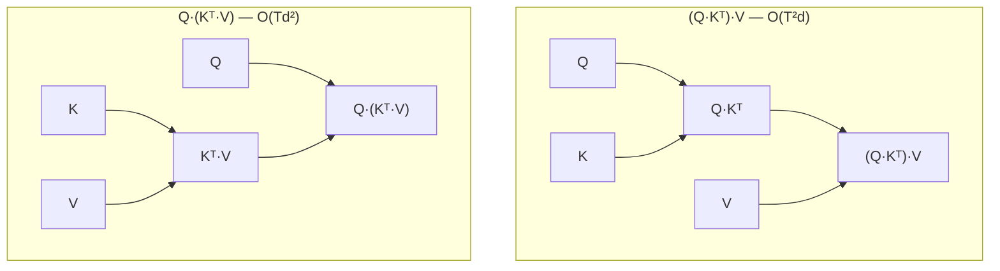

# catopt

[](https://github.com/luisfuturist/catopt/actions/workflows/ci.yml)


**A program optimizer's reachable set is bounded by its semantic
language, not its search strategy.**  Tensor-level compilers rewrite
*ops*; catopt rewrites over *algebraic structure* — monoid carriers,
traced-monoidal fixpoints, products as `⟨f₁,…,f_k⟩ = (×fᵢ)∘Δ` — so it
reaches programs no op-level pattern composes to.  Every delivered
program carries a **replayable certificate** of equivalence, re-checked
on real terms.

The engine (`catopt-core`) is torch-free and backend-agnostic; PyTorch
(`catopt-torch`) is the shipped reference backend.  One call runs the
whole pipeline:

```python
from catopt_orchestrator import Optimizer
from catopt_torch import TorchBackend

opt, stats = Optimizer(backend=TorchBackend()).optimize(model, x)
out = opt(x)        # the same function as model(x) — verified, not spot-checked
```

## The transformation it found

`(Q·Kᵀ)·V → Q·(Kᵀ·V)`: the intermediate goes from T×T to d×d — an
asymptotic change (O(T²d) → O(Td²)), not a tuning.  Catopt found and
justified it from associativity plus a shape-aware cost model.  **There
is no hand-written "reassociate attention" rule.**



The novelty is not the algebra — it is that the optimizer *discovered*
and *certified* it, and delivers it end to end, without an
attention-specific rule.

## The idea in three steps

1. **Lift.**  The model *and its weights* export into one typed term
   (torch: `torch.export`); parameters are ordinary leaves.
2. **Search.**  Equality saturation closes that term under equational
   *and* categorical laws — associativity, homomorphism, the traced
   monoidal axioms, the product law — enumerating the equivalence class
   rather than applying a fixed pass list.
3. **Prove and deliver.**  A cost model extracts the cheapest
   representative the backend can actually lower; the derivation is
   verified; you get back a runnable `torch.nn.Module` plus a stats dict
   (`stats["rule_fires"]`, `stats["lowering"]`, `stats["runner"]`, …).

→ The conceptual pipeline is in [`docs/mechanism.md`](docs/mechanism.md);
the thesis it implements is
[ADR 0002](project/adrs/0002-categorical-re-expression-thesis.md).

## Quickstart

```bash
uv sync                 # dev env — all workspace members editable
python demo.py          # ~60-second end-to-end run on CPU
```

`demo.py` walks one gated projection block through the whole pipeline:
the e-graph search, the certificate replayed through the standalone
verifier, the extracted op tree, and a synced median race against eager
and `torch.compile`.  It re-execs under `PYTHONHASHSEED=0`, so the
search, extraction and certificate are bit-for-bit reproducible.

## What it finds — and what it doesn't

The measured picture is generated from the pinned baselines — see
[`docs/results.md`](docs/results.md) for magnitudes, hardware and
provenance.  The verdicts:

| Regime | Verdict | Why |
|---|---|---|
| Deep weight chains (`reassoc_scale`) | **WIN** | the e-graph reaches a weights-first form Inductor's post-grad graph provably cannot express |
| Shared-input projections / gated blocks (`real_win_hunt`, `killer_demo`) | **WIN** | pairing fuses k projections into one GEMM + split views |
| Linear-attention scan lift (`real_linear_attn`) | **WIN** | the affine-monoid scan lift fires and verifies fp64-exact |
| Morphism windows (`morphism_e2e`) | **WIN** | term-FLOP reduction converts to wall time at GEMM-bound sizes |
| Whole-model E2E (`e2e_model`, `e2e_models2`) | **PARITY** | pairing fires per block and verifies fp64-exact, but wall time is ~parity |
| Real trained checkpoints, exact mode (`structure_census`) | **PARITY** | dense weights carry ~zero exploitable bitwise structure |
| Launch-bound decode (`decode_bench`) | **NEGATIVE** | fewer launches don't pay where launch overhead already dominates — the hypothesis is falsified |
| Bounded rewrites on a real checkpoint (`bounded_e2e`) | **NEGATIVE** | `error_budget=` rewrites buy nothing on stories15M at any budget |

This is **not a universal speedup**.  Attention- and GEMM-bound code is
already optimal — expect a parity floor there — and the losses are
measured too.  The wins live where structure exists: shared-input
projections, foldable weight chains, unnormalized attention,
recurrences.

## Verification is the point

Discovery is cheap; pricing is hard; proof is what keeps it honest.
Every extracted program ships with an ordered, replayable derivation
`original → optimized`, and `verify_certificate` re-checks
*derivational equivalence* on real terms (fp64) — not numerical
spot-checks:

```python
from catopt_core.egraph import verify_certificate

verify_certificate(ir.root, cert, strict=True)   # replay every step
```

It has caught a false-proof matcher bug, a shape misinference that
fabricated a 1.98× "win", a well-typed but wrong program, and a
launch-time-vs-execution timing bug — all regression-tested.

## Generality — the honest split

The **framework** is general: e-graph saturation, verification, cost
extraction, backends, strategies, runners and rule sets are all
pluggable and model-agnostic.  What is **narrow** is the *law library*:
like every rule-based optimizer (Halide, TASO, verified compilers),
catopt finds the structures its laws describe — an unmatched block is an
opaque boundary, never a wrong answer.  The morphism engine is the
generality mechanism: laws target signature *classes* (any residual
chain, any shared-projection family) rather than specific op trees.

## Limits

- **Wins are regime-dependent** — the transform set is structural:
  pairing, folds, reassociation, carrier lifts.  A model that is already
  dense-GEMM-bound with no shared structure should expect parity.
- **Search is compile-time work** — seconds per block; monolithic eqsat
  slows past ~8 blocks, which is why the `Compositional` strategy exists.
- **Inference only** — weight folding destroys per-layer gradients; no
  backward-graph rewriting.
- **Coverage gaps** — `matmul`+bias and grouped convs aren't pairable;
  reassociation needs unnormalized attention; masks must arrive
  materialized.
- **Dev-box numbers** — measured on an RTX 2050 (4 GB) / CPU.
  `calibrate()` re-targets the cost model, but magnitudes do not
  extrapolate to datacenter hardware.

## Install

Python ≥3.11 (developed on 3.13), `torch>=2.0`, `numpy>=1.24`.
uv-workspace monorepo: `packages/catopt-core` (zero-dependency engine),
`catopt-torch` (PyTorch adapters), `catopt-carriers` (scan/attention
carriers), `catopt-cuda` (the CUDA-graph runner), `catopt-orchestrator`
(the backend-neutral pipelines).  There is no `catopt` façade package —
import the domain packages directly.

```bash
uv sync                                  # everything, editable

# or with pip:
pip install -e packages/catopt-core -e packages/catopt-torch \
    -e packages/catopt-carriers -e packages/catopt-cuda \
    -e packages/catopt-orchestrator

pip install -e packages/catopt-core      # engine only, zero deps
```

Optional: `packages/catopt-native` is the PyO3/Rust search engine
(build with maturin; opt-in via `engine=` — never auto-detected).

## Benchmarks

Every claim above is a runnable suite under `bench/`, and the harness is
a system rather than a pile of scripts: each suite states its conclusion
as a typed **finding** (`win` / `parity` / `regression` / `negative` /
`inconclusive`), and every surface — JSON, Markdown, HTML, plots,
Quarto, Slidev — is rendered from one canonical `Report`.

```bash
python -m bench list                        # the catalog
python -m bench run reassoc_scale           # one suite → JSON+MD+HTML+plots
python -m bench run-all                     # every harnessed suite
python -m bench results                     # regenerate docs/results.md
python -m bench dashboard                   # cross-suite HTML index
```

Suites are organized by **intent** — the question each answers.
`bench/registry.py` is the single source of truth; `bench/README.md`
carries the generated catalog with expected verdicts.  Per-suite
protocols, flags and expected outcomes: [`bench/README.md`](bench/README.md).

## Docs

| Doc | What it is |
|---|---|
| [`docs/mechanism.md`](docs/mechanism.md) | the conceptual pipeline — syntax → structure → search → certificate |
| [`docs/results.md`](docs/results.md) | measured results, generated from the pinned baselines |
| [`docs/api.md`](docs/api.md) | the API surface — `Optimizer`, strategies, runners, criteria, ports |
| [`bench/README.md`](bench/README.md) | the benchmark harness and its suite catalog |
| [`project/RESEARCH_WRITEUP.md`](project/RESEARCH_WRITEUP.md) | the claim, the verified results, the honest negatives |
| [`project/REPORT.md`](project/REPORT.md) | the research report — weights as programs, the ε axis, what was falsified |
| [`AGENTS.md`](AGENTS.md) | repo layout, verification commands, port contracts |
