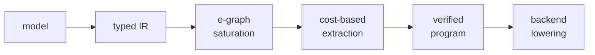
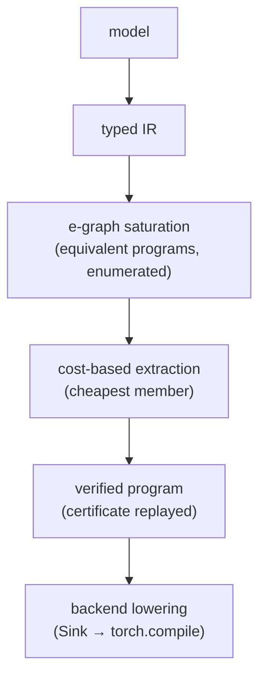

---
layout: cover
title: CatOpt × Liquid AI
class: cover-hero
transition: fade
---

<div class="hero">

<div class="kicker"><span class="dot"></span>CatOpt&nbsp;×&nbsp;Liquid AI</div>

# Automatically discovering faster implementations of neural blocks

<div class="hero-sub">
A complementary layer to architecture&nbsp;/&nbsp;block search
</div>

<div class="hero-meta">
Luis&nbsp;·&nbsp;<span class="muted">catopt</span>&nbsp;·&nbsp;2026
</div>

</div>

<!--
15 minutes, one idea: CatOpt searches the *implementation* space that architecture
search leaves on the table. The ask is deliberately small — one real Liquid block,
one experiment.
-->

---
title: The gap
---

# The gap

<div class="cols">
<div class="panel">

### <carbon:layers /> Liquid searches for

**good blocks / architectures**

<v-clicks>

- block type, width, connectivity
- recurrence vs. attention
- hardware-aware selection <span class="tag">STAR</span> <span class="tag">LIV</span>

</v-clicks>

</div>
<div class="panel accent">

### <carbon:code /> But inside a block…

<v-clicks>

- implementation choices are still **manual**
- **heuristic** / compiler-dependent
- bounded by *what the optimizer knows how to rewrite*

</v-clicks>

</div>
</div>

<div class="question">
<v-click>

Can we automatically search the <span class="q">implementation space</span> too?

</v-click>
</div>

<!--
Liquid already owns "which block" (STAR, LIV operators, hardware-in-the-loop NAS).
The gap: once a block exists, *how it is computed* is still hand-tuned or limited to
whatever Inductor happens to rewrite. That is the space CatOpt searches.
-->

---
title: What CatOpt does
---

# What CatOpt does

<div class="steps">
<div class="step" v-click>
<div class="n">1</div>
<div>
<h4><span class="icon"><carbon:search /></span> Search equivalent programs</h4>
<div class="desc">algebraic rewrites · e-graphs · reassociation / folding / scan transformations</div>
</div>
</div>
<div class="step" v-click>
<div class="n">2</div>
<div>
<h4><span class="icon"><carbon:scales /></span> Select candidates</h4>
<div class="desc">cost-guided extraction · target-hardware measurements</div>
</div>
</div>
<div class="step" v-click>
<div class="n">3</div>
<div>
<h4><span class="icon"><carbon:certificate /></span> Verify the result</h4>
<div class="desc">replayable equivalence certificates — transformations are checked, not merely assumed</div>
</div>
</div>
</div>

<div v-click>



</div>

<!--
Three verbs: search, select, verify. The verify step is the differentiator — every
delivered program carries an ordered, replayable derivation `original → optimized`
that is re-checked on real terms, not spot-checked numerically.
-->

---
title: Two complementary search spaces
---

# Two complementary search spaces

<div class="spaces">

| Architecture search | CatOpt |
|---|---|
| **Which block should exist?** | **How should that block be computed?** |
| layer structure | equivalent algebraic forms |
| operators | operation elimination |
| dimensions | reassociation |
| connectivity | fusion opportunities |
| hardware-aware selection | alternative execution structure |

</div>

<div class="question">
<v-click>

Same block → <span class="q">many equivalent programs</span> → potentially very different runtime.

</v-click>
</div>

<!--
The two searches compose: Liquid picks the block, CatOpt picks the cheapest equivalent
program that computes it. Same dimensions, same numerics, different execution structure.
-->

---
title: Why this matters for Liquid
---

# Why this matters for Liquid

CatOpt could turn a discovered block into a **better implementation**, not just a benchmark result.

<v-clicks>

- Search transformations humans may not think to encode as heuristics
- Explore aggressive algebraic transformations automatically
- **Verify** transformations before deploying them
- Optimize specifically for target hardware

</v-clicks>

<div class="chips">
<span v-click><carbon:block-storage class="icon" /> memory traffic</span>
<span v-click><carbon:cube class="icon" /> GEMMs</span>
<span v-click><carbon:flow-stream class="icon" /> scans</span>
<span v-click><carbon:rocket class="icon" /> kernel launches</span>
<span v-click><carbon:layers class="icon" /> fusion</span>
</div>

<div v-click>

> LFM2's hybrid backbone — gated short convolutions + GQA — is exactly the kind of block whose *implementation* has many equivalent forms.

</div>

<!--
Connect to what Liquid ships: edge latency and memory budgets, CPU/GPU/NPU targets,
hybrid conv + attention blocks. Those are precisely the axes CatOpt's transforms move
(memory traffic, GEMM fusion, scan structure, launch count).
-->

---
title: The experiment
---

# The experiment

### Start with **one real Liquid block**

<div class="exp">
<div class="row" v-click>
<div class="num">01</div>
<div><span class="label">Input</span> — take an existing production / research block.</div>
</div>
<div class="row" v-click>
<div class="num">02</div>
<div><span class="label">Search</span> — let CatOpt generate equivalent implementations.</div>
</div>
<div class="row" v-click>
<div class="num">03</div>
<div><span class="label">Measure</span> — benchmark against the current Liquid implementation and the PyTorch / Inductor baseline.</div>
</div>
<div class="row" v-click>
<div class="num">04</div>
<div><span class="label">Inspect</span> — understand <em>why</em> any candidate wins.</div>
</div>
</div>

<!--
The scope is one block, not the stack. Low commitment, high information: if the two
search spaces compose on a single real block, it generalizes.
-->

---
title: What would make this compelling?
---

# What would make this compelling?

Not another synthetic benchmark.

A real block where:

<v-clicks>

- CatOpt produces a **meaningful end-to-end speedup**
- the transformation is **structurally different**
- the result is **reproducible on target hardware**
- the transformation is something the existing search **wouldn't naturally discover**

</v-clicks>

<div class="callout" v-click>
<h4>Best outcome</h4>
<blockquote>A useful discovered transformation feeds back into Liquid's own search space.</blockquote>
</div>

<!--
Set the bar honestly. The win condition is not a microbenchmark number — it is a
structurally different, verified, reproducible transformation that Liquid would not
have found by hand.
-->

---
layout: center
title: The thesis
class: text-center
---

<div class="thesis">
<div
  v-motion
  :initial="{ opacity: 0, y: 32 }"
  :enter="{ opacity: 1, y: 0, transition: { duration: 700 } }"
>
<div><span class="a">Liquid searches for the right computation.</span></div>
<div style="margin-top:.4rem"><span class="b">CatOpt searches for the right way to compute it.</span></div>
</div>
</div>

<div class="thesis-foot" v-click>
One real block is enough to test whether the two search spaces compose.
</div>

<!--
The whole pitch in two sentences. Everything before is the argument; everything after
is the (small) ask.
-->

---
layout: default
title: Under the hood (backup)
---

<div class="badge-backup">Backup</div>

# Under the hood

<div class="cols">
<div>



<div style="margin-top:.4rem">

Reassociation is a pure work reduction:

$$(QK^\top)V \;\longrightarrow\; Q(K^\top V) \qquad O(T^2 d)\to O(Td^2)$$

</div>

</div>
<div>

Carriers reach structures op-level rules cannot. An unrolled recurrence:

````md magic-move
```py
# eager: depth grows with the horizon
h = x[:, 0]
for t in range(1, T):
    h = A @ h + x[:, t]
```
```py
# carrier: same associativity law, balanced scan
from catopt.optimize import optimize_model

opt, report = optimize_model(block, example_input)
out = opt(x)          # certificate-backed, equivalent
```
```py
# delivered: Blelloch tree over the affine monoid
h = scan(aff(A, b), x)   # depth 2T → ~2·log₂T
```
````

</div>
</div>

<!--
Optional depth if asked. Left: the pipeline and an asymptotic reassociation. Right:
the affine carrier turns an unrolled recurrence into a balanced scan — same law,
different reachable set. CatOpt's engine is torch-free; PyTorch is one Sink.
-->

---
layout: default
title: Evidence & honesty (backup)
---

<div class="badge-backup">Backup</div>

# Evidence &amp; honesty

Verified on unmodified community code — and measured including the losses:

<div class="cols">
<div>

| Transform | Result |
|---|---|
| Projection pairing (QKV, gate·up) | **1.24×** vs Inductor, end-to-end |
| `(QKᵀ)V → Q(KᵀV)` | **8.0×** at T=2048 |
| k-deep chain → 1 GEMM (k=16) | **15.9×** vs Inductor GPU |
| Attention fold → `sdpa(is_causal)` | **4.6×** vs eager |
| Streaming attention (om monoid) | **260×** vs sdpa-recompute @ 65k |

</div>
<div>

On `llama2.c` it rediscovers `MergedColumnParallelLinear` and
`QKVParallelLinear` — transforms vLLM and TensorRT-LLM implement by hand.

<div class="panel accent" style="margin-top:1rem">

**Where it does *not* win:** GEMM pairing on transformer blocks is
parity; trained checkpoints show no win at these sizes; launch-bound
decode cells lose 4–15%. The verifier has caught a fabricated 1.98×
"win" and a semantically wrong program (diff 9.83) — all
regression-tested.

</div>
</div>
</div>

<!--
Credibility slide. Lead with the wins, but volunteer the losses — a researcher will
trust the parity rows more than the headline numbers. The verifier catching a
fabricated win is the strongest signal that the pipeline is real.
-->

---
layout: center
title: Next step
class: text-center
---

<div class="ask">

<div class="big">One block.<br/>One experiment.</div>

<div class="sub">
Pick a real Liquid block — we run CatOpt, measure, and report back either way.
</div>

<div class="contact">
github.com/luisfuturist/catopt&nbsp;&nbsp;·&nbsp;&nbsp;luisfuturist
</div>

</div>

<!--
End on the smallest possible commitment. "Report back either way" signals this is a
test of a hypothesis, not a sales pitch.
-->
